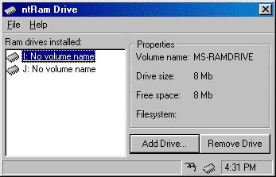



## RAM Drive

### Description

Tired of try to figure out archane DOS commandline params? Just use the utility and YOU too can have your VERY own RAM drive! No need to edit your system configuration files, the program will add AND remove the drives from your config files.
 
### More Info
 
It doesn't not make a backup of your config.sys file, so don't expect any config.bak file. Make sure you make a copy of it.

             |
---                |---
**Submitted On**   |2000-03-22 09:27:10
**By**             |[Shannon Little](https://github.com/Planet-Source-Code/PSCIndex/blob/master/ByAuthor/shannon-little.md)
**Level**          |Advanced
**User Rating**    |5.0 (15 globes from 3 users)
**Compatibility**  |VB 5\.0, VB 6\.0
**Category**       |[Complete Applications](https://github.com/Planet-Source-Code/PSCIndex/blob/master/ByCategory/complete-applications__1-27.md)
**World**          |[Visual Basic](https://github.com/Planet-Source-Code/PSCIndex/blob/master/ByWorld/visual-basic.md)
**Archive File**   |[CODE\_UPLOAD41323222000\.zip](https://github.com/Planet-Source-Code/shannon-little-ram-drive__1-6751/archive/master.zip)

